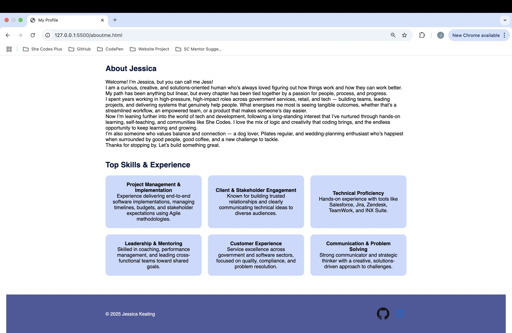
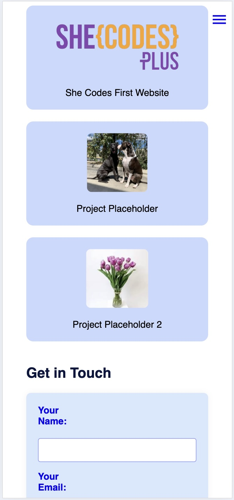
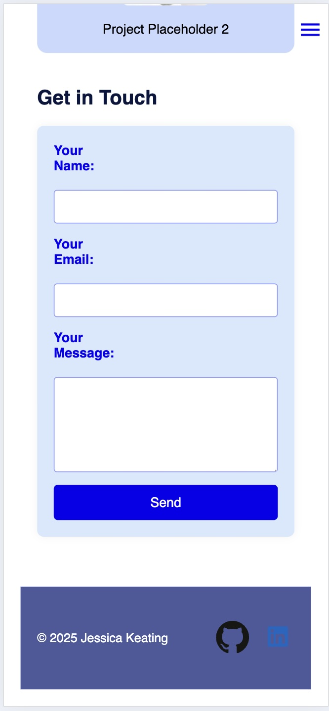

# Jess-K92.github.io
#  Jessica Keating - Portfolio Task
​
[My portfolio site](https://jess-k92.github.io/index.html)
​
## Project Requirements

### Content
 Add a short paragraph describing the features below. What aesthetic and technical choices did you make? 
- [X] At least one profile picture
- [X] Biography (at least 100 words)
- [X] Functional Contact Form
- [X] "Projects" section
- [X] Links to external sites, e.g. GitHub and LinkedIn.
​
### Technical
 Add a short paragraph describing the features below. What strategies or design decisions did you work from? 
- [X] At least 2 web pages.
I have added an About Me page where I have included further information about myself, my experience and skills. This page also has a functioning menu that will take you back to the home page and/or to the other sections on the home page depending on your menu selection.
- [X] Version controlled with Git
My GitHub repositiry can be found here (https://github.com/Jess-K92/Jess-K92.github.io). Where I have followed best practice to version track my updates and the deployment.
- [X] Deployed on GitHub pages.
My GitHub repositiry can be found here (https://github.com/Jess-K92/Jess-K92.github.io). Where I have followed best practice to version track my updates and the deployment.
- [X] Implements responsive design principles.
Media queries have been included to ensure that the content can be viewed in a easy to read manner that is appealing.
- [X] Uses semantic HTML.

### Bonus (optional)
 Add a short paragraph describing the features below, if you included any. 
- [X] Different styles for active, hover and focus states.
I included hover state on the Skills and Project cards on the Home page and also on the About Me page to hightlight the information.
- [ ] Include JavaScript to add some dynamic elements to your site. (Extra tricky!)
​
### Screenshots
> Please include the following:
> - The different pages and features of your website on mobile, tablet and desktop screen sizes (multiple screenshots per page and screen size).
> - The different features of your site, e.g. if you have hover states, take a screenshot that shows that.  
> 
> You can do this by saving the images in a folder in your repo, and including them in your readme document with the following Markdown code: 

####  Wireframe images 

####  Desktop Screenshots

####  Mobile Screenshots

